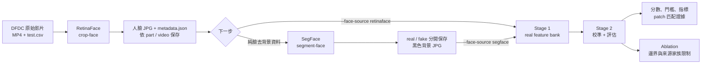
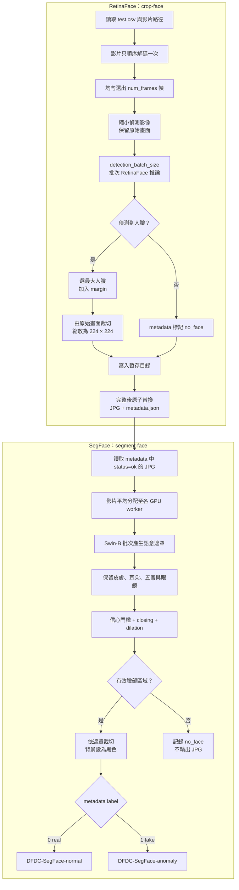
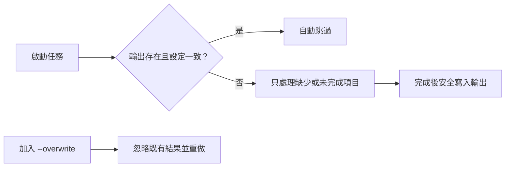
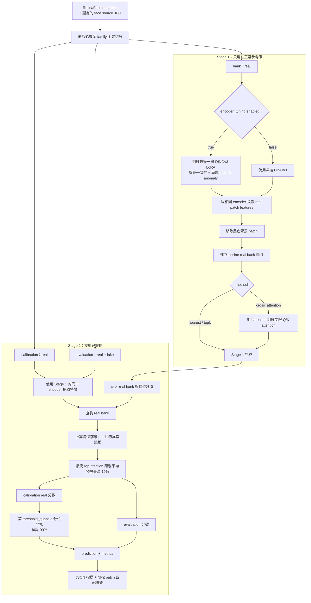

# DeepFakeSecurity

本專案處理 DFDC 影片，提供 RetinaFace 人臉裁切、SegFace 語意切割，以及 DINOv3 real feature bank 的建立、校準與評估。所有入口都會自動啟用 Conda 環境 `pt230`。

## 完整資料流



`--face-source retinaface|segface` 決定 Stage 1 使用原始人臉框或 SegFace 純臉 JPG；兩者都沿用 RetinaFace 的 `metadata.json` 做來源 family 切分。

## 快速開始

```bash
cd /ssd8/chihyu/Project/DeepFakeSecurity

# 1. RetinaFace：5 張 GPU 裁切 DFDC，每支影片抽 32 幀
bash mission.sh crop-face \
  --num-frames 32 \
  --gpus 0,1,2,3,4

# 2. SegFace：5 張 GPU，每張卡一個 worker，batch size 8
bash mission.sh segment-face \
  --cores 5 \
  --gpus 0,1,2,3,4 \
  --batch-size 8

# 3. 第一個研究基準：SegFace + frozen DINOv3 + 1-NN
bash mission.sh stage1 --exper SEGFACE_FROZEN_NN_V1 \
  --face-source segface --no-tune-encoder --method nearest \
  --gpus 0 1 2 3 4 --batch-size 8
bash mission.sh stage2 --exper SEGFACE_FROZEN_NN_V1 \
  --face-source segface --no-tune-encoder --method nearest \
  --gpus 0 1 2 3 4 --batch-size 8

# 4. 完成 nearest baseline 後，再另建 topk 實驗與消融
# bash mission.sh ablation --exper <已完成的 TOPK 實驗> --method topk ...
```

GPU 參數有兩種格式：

| 任務 | 格式 | 範例 |
| --- | --- | --- |
| `crop-face`、`segment-face` | 逗號分隔 | `--gpus 0,1,2,3,4` |
| `stage1`、`stage2`、`ablation` | 空白分隔 | `--gpus 0 1 2 3 4` |

## 前處理流程



### 前處理輸入與輸出

| 項目 | 目前位置／格式 |
| --- | --- |
| DFDC 影片 | `crop_face.data_root` |
| DFDC 標籤 | `crop_face.label_csv` |
| RetinaFace 輸出 | `/ssd8/chihyu/Dataset/DeepFake_Dataset/DFDC/<part>/<video>/` |
| RetinaFace 檔案 | `frame_*.jpg`、`metadata.json` |
| SegFace real | `/ssd8/chihyu/Dataset/DeepFake_Dataset/DFDC-SegFace-normal/` |
| SegFace fake | `/ssd8/chihyu/Dataset/DeepFake_Dataset/DFDC-SegFace-anomaly/` |

SegFace 會將來源路徑展平成可追溯檔名，例如：

```text
dfdc_train_part_0-video_name-frame_000001.jpg
```

### 續跑判斷



一般續跑不要加入 `--overwrite`。RetinaFace 以整支影片和 `metadata.json` 判斷完成狀態；SegFace 逐張檢查目標 JPG。兩者都使用 `tqdm`：RetinaFace 顯示一條總進度，SegFace 每張 GPU 顯示一條進度。

### 少量測試與 CPU 模式

```bash
# RetinaFace：兩支影片、每支四幀
bash mission.sh crop-face --limit 2 --num-frames 4 --gpus 0

# SegFace：每類一支影片、每支一張
bash mission.sh segment-face --limit 1 --frames-per-video 1 --cores 1 --gpus 0

# RetinaFace CPU
bash mission.sh crop-face \
  --num-frames 32 \
  --gpus none \
  --device cpu \
  --workers 8 \
  --cpu-threads 2
```

## Feature bank 流程



訓練、校準與評估的來源 family 不重疊。fake 不會進入 real bank；目前 `encoder_tuning.fake_weight: 0.0`，LoRA 也不讀取真實 fake。

### 評分方法

| `retrieval.method` | Patch 異常距離 |
| --- | --- |
| `nearest` | `1 -` 最相似 real patch 的 cosine similarity |
| `topk` | Top-K real patches 經 cosine softmax 加權後的重建誤差 |
| `cross_attention` | 受限多頭 Q/K attention 對 Top-K real values 的重建誤差 |

目前 YAML 預設為 `topk`。圖片分數是最高 10% 前景 patch 距離的平均值；分數越高代表越偏離 real bank，並不是 fake 機率。

### Feature bank 輸出

```text
RAG/normal/<EXPERIMENT>/
  bank_config.json
  splits.json
  <part>/<video>/*.npy
  retrieval/                     # real bank 索引
  cache/calibration/             # 不會加入 real bank
  cache/evaluation/              # 不會加入 real bank

outputs/feature_bank/<EXPERIMENT>/
  stage1/config.json
  stage1/splits.json
  stage1/retrieval.json
  stage1/dino_lora.safetensors   # 啟用 LoRA 時存在
  stage1/attention.json          # cross_attention 時存在
  stage2/thresholds.json
  stage2/metrics.json
  stage2/evaluation_scores.json
  stage2/*/patch_matches/*.npz
```

## 設定位置

命令列參數會覆寫 `utils/config.yaml`：

| YAML 區塊 | 控制內容 |
| --- | --- |
| `crop_face` | DFDC 路徑、GPU、抽幀、RetinaFace batch、門檻、margin、輸出大小 |
| `segment_face` | SegFace 模型、輸入輸出、batch、遮罩類別與形態學參數 |
| `mission` | SegFace 的預設 CPU 核心與 GPU 清單 |
| `retrieval` | 人臉來源、實驗名稱、GPU、DINO batch、LoRA、檢索方法、門檻與消融 |
| `model_path` | 本地 DINOv3 模型目錄 |

常用資源參數：

| 參數 | 用途 |
| --- | --- |
| `crop-face --detection-batch-size N` | 每次 RetinaFace 推論的幀數 |
| `segment-face --batch-size N` | 每個 SegFace worker 的圖片 batch |
| `segment-face --cores N` | 所有 SegFace worker 共用的 CPU 核心總數 |
| `stage1/2 --batch-size N` | 每張 GPU 的 DINO 圖片 batch |
| `stage1/2 --workers N` | 所有 GPU 共用的 JPG／NPY 讀取執行緒上限 |

## 模型與依賴

```bash
# 依賴
conda run -n pt230 python -m pip install \
  -r requirements-crop.txt \
  -r requirements-segment.txt

# SegFace 權重缺少時重新安裝
conda run --no-capture-output -n pt230 \
  python -m script.setup_segface
```

| 模型 | 路徑 |
| --- | --- |
| RetinaFace | 首次執行下載至 `crop_face.cache_dir/.deepface/weights/` |
| SegFace Swin-B | `models/segface/swinb_celeba_512/model.safetensors` |
| DINOv3 | `model_path`，預設 `models/dinov3-vitb16-pretrain-lvd1689m` |

## 執行規則

1. Stage 1 與 Stage 2 必須使用相同的 `--exper`。
2. 修改資料、模型、LoRA 或評分設定時，使用新的實驗名稱。
3. `stage2` 需要已完成且雜湊驗證成功的 Stage 1。
4. `ablation` 在 Stage 2 後執行，不會覆寫主要結果。
5. 輸出目錄有程序鎖；同一實驗或同一 SegFace 輸出不可重複啟動。
6. 目前評估是 DFDC 清單內的來源家族切分，不是官方 DFDC test，也不是 identity-disjoint 結果。

查看入口說明：

```bash
bash mission.sh --help
bash run.sh --help
```
