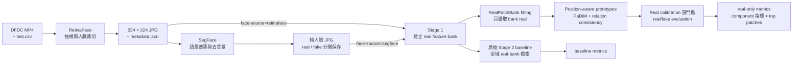
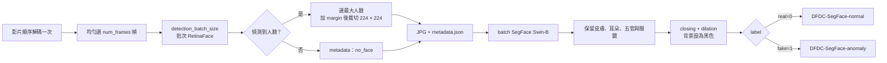
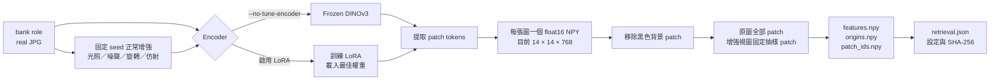
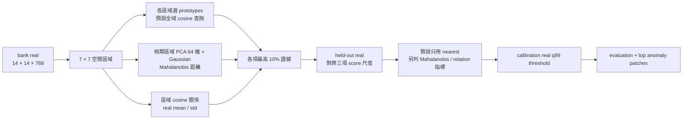

# DeepFakeSecurity

本專案將 DFDC 影片轉成人臉資料，建立 DINOv3 real patch feature bank，再以獨立的 real calibration 與 real/fake evaluation 資料進行異常偵測。所有入口都會自動啟用 Conda 環境 `pt230`。

目前主基準是 frozen DINOv3 + 完整 bank 全域 1-NN。新實驗預設在切分前合併 JPEG 內容
重複的來源家族，並將遮罩邊界距離乘以 0.5 後取最高 10% 平均。這些是待驗證設定，
既有 evaluation 上的診斷改善不代表新實驗已取得相同成績；評分參數應在 training 內另留的
validation 上比較，calibration 僅設門檻，evaluation 不用於挑選參數。

## 1. 快速開始

```bash
cd /ssd8/chihyu/Project/DeepFakeSecurity

# Step 1：RetinaFace 裁切人臉
bash mission.sh crop-face \
  --num-frames 32 \
  --gpus 0,1,2,3,4

# Step 2：SegFace 保留純人臉並移除背景
bash mission.sh segment-face \
  --cores 5 \
  --gpus 0,1,2,3,4 \
  --batch-size 8

# Step 3：frozen DINOv3 提取 real patch features 並建立 1-NN bank
bash mission.sh stage1 \
  --exper SEGFACE_FROZEN_NN_DEDUP_V2 \
  --face-source segface \
  --no-tune-encoder \
  --method nearest \
  --gpus 0 1 2 3 4 \
  --batch-size 8 \
  --workers 16

# Step 4：以 real calibration 設定門檻，再評估保留的 real/fake
bash mission.sh stage2 \
  --exper SEGFACE_FROZEN_NN_DEDUP_V2 \
  --face-source segface \
  --no-tune-encoder \
  --method nearest \
  --gpus 0 1 2 3 4 \
  --batch-size 8 \
  --workers 16

# Step 5（選用消融）：只用 bank real fitting prototype anomaly model
bash mission.sh real-patch-bank \
  --stage fit \
  --exper SEGFACE_FROZEN_NN_DEDUP_V2 \
  --gpus 0

# 只用 real calibration 設定門檻，再評估 real/fake
bash mission.sh real-patch-bank \
  --stage evaluate \
  --exper SEGFACE_FROZEN_NN_DEDUP_V2 \
  --gpus 0 1 2 3 4

# Step 6（選用 supervised baseline）：訓練真偽分類器
# 首次執行先以多 GPU 快取 train_fake features
bash mission.sh patch-mil \
  --stage cache \
  --exper SEGFACE_FROZEN_NN_DEDUP_V2 \
  --gpus 0 1 2 3 4

# 訓練 classifier 時只使用第一張指定 GPU
bash mission.sh patch-mil \
  --stage train \
  --exper SEGFACE_FROZEN_NN_DEDUP_V2 \
  --gpus 0

# 評估 supervised classifier
bash mission.sh patch-mil \
  --stage evaluate \
  --exper SEGFACE_FROZEN_NN_DEDUP_V2 \
  --gpus 0
```

GPU 參數格式依入口不同：

| 任務 | GPU 格式 | 範例 |
| --- | --- | --- |
| `crop-face`、`segment-face` | 逗號分隔 | `--gpus 0,1,2,3,4` |
| `stage1`、`stage2`、`ablation`、`real-patch-bank`、`patch-mil` | 空白分隔 | `--gpus 0 1 2 3 4` |

只建立並檢查資料切分、不提取特徵：

```bash
bash mission.sh stage1 \
  --stage prepare \
  --exper SEGFACE_FROZEN_NN_DEDUP_V2 \
  --face-source segface \
  --no-tune-encoder \
  --method nearest
```

## 2. 完整流程



`--face-source retinaface|segface` 只改變 DINOv3 讀取的 JPG。兩種來源都使用 RetinaFace 的 `metadata.json` 與 DFDC 原始 metadata 維持相同的影片標籤和來源 family 關係。

## 3. 人臉前處理



### 輸入與輸出

| 資料 | 位置／格式 |
| --- | --- |
| DFDC 影片 | `crop_face.data_root` |
| DFDC 清單 | `crop_face.label_csv` |
| RetinaFace | `/ssd8/chihyu/Dataset/DeepFake_Dataset/DFDC/<part>/<video>/` |
| RetinaFace 檔案 | `frame_*.jpg`、`metadata.json` |
| SegFace real | `/ssd8/chihyu/Dataset/DeepFake_Dataset/DFDC-SegFace-normal/` |
| SegFace fake | `/ssd8/chihyu/Dataset/DeepFake_Dataset/DFDC-SegFace-anomaly/` |

SegFace 採用可追溯的扁平檔名：

```text
dfdc_train_part_0-video_name-frame_000001.jpg
```

### 續跑與測試

- RetinaFace 以整支影片的 `metadata.json` 與設定判斷是否完成。
- SegFace 逐張檢查目標 JPG；已完成圖片自動跳過。
- 一般續跑不要加入 `--overwrite`；該參數會強制重做。
- RetinaFace 顯示一條總 `tqdm`；SegFace 每張 GPU 顯示一條 `tqdm`。

```bash
# 小型 RetinaFace 測試：兩支影片、每支四幀
bash mission.sh crop-face --limit 2 --num-frames 4 --gpus 0

# 小型 SegFace 測試：每類一支影片、每支一張
bash mission.sh segment-face --limit 1 --frames-per-video 1 --cores 1 --gpus 0

# RetinaFace CPU 模式
bash mission.sh crop-face --num-frames 32 \
  --gpus none --device cpu --workers 8 --cpu-threads 2
```

## 4. Feature bank

### 固定資料切分

切分單位是 DFDC 原片與其 fake 衍生影片所形成的來源 family。新實驗會先對所有候選圖片
（含 train_fake）計算 JPEG SHA-256；任一圖片內容相同的 family 以連通群組合併，連同其 fake
衍生影片一起切分。合併後的 `group_id` 不會跨越 training、calibration 與 evaluation；
原始 family 保存在影片的 `source_group_id`，雜湊保存在 frame 的 `content_sha256`。
`splits.json` 的 `audit.content_deduplication` 記錄合併清單。這不保證近重複或身份完全獨立。

新的設定必須用新 experiment，例如 `SEGFACE_FROZEN_NN_DEDUP_V2`。舊 `V1` 的 splits、
cache 與 model 不能直接搬過去，因為 role、group_id 及 sample_id 可能改變。若需重現舊版，
Stage 1/2 均明確加上 `--no-deduplicate-content --boundary-weight 1 --no-tune-encoder --method nearest`。

目前 `SEGFACE_FROZEN_NN_V1` 的完整切分：

| Role | 影片 | 圖片 | 標籤 | 使用階段 |
| --- | ---: | ---: | --- | --- |
| `bank` | 1,304 | 41,570 | real | Stage 1 |
| `train_fake` | 7,189 | 229,217 | fake | 目前 baseline 不使用 |
| `calibration` | 279 | 8,897 | real | Stage 2 門檻 |
| `evaluation` | 3,141 | 100,107 | real + fake | Stage 2 評估 |

### Stage 1：建立正常參考庫

Stage 1 將 `bank` 中的 real 人臉轉成可搜尋的正常 patch 參考庫。它不設定異常門檻，也不計算測試指標。



Stage 1 依序完成：

1. 合併 exact JPEG 重複 family 後建立 `splits.json`，或沿用同設定的既有 split。
2. 只對 `bank` real 產生固定 seed 的正常增強視圖；calibration、evaluation 與 fake 不增強。
3. 每個增強視圖同時加入光照、前景輕噪聲、2–7 度旋轉與輕微 scale／shear／translation。
   幾何變換以黑色填補，噪聲只加入 SegFace 前景，避免把背景噪聲誤當成人臉 patch。
4. 依設定使用 frozen DINOv3，或先訓練最後一層 LoRA，再分別對原圖與增強圖重新提取特徵。
5. 每張 224×224 圖片保存完整 `14×14×768` float16 patch features，中斷後可逐檔續接。
6. 依 `foreground_minimum` 移除黑色背景比例過高的 patch。原圖的前景 patch 全部進入
   exact NN bank；每張增強視圖以固定 seed 抽取 25% 前景 patch，避免 bank 超過單張 GPU 顯存。
7. 保存原始來源、增強參數、影像／設定雜湊與 patch 空間位置，再寫入完成紀錄。

增強後的完整 token grid 也會納入 only-real reconstruction 與 RealPatchBank fitting，且沿用原圖
`group_id`，所以原圖與其增強版本一定落在相同 family partition。這些資料只擴充正常訓練分布，
不會進入 calibration 或 evaluation。預設每張 real 一個增強視圖；若修改任何增強參數，必須使用
新的 experiment 名稱，才能保留不同 Feature Bank 的可比較性。

```bash
# 增強版 Stage 1；不要沿用未增強 bank 的實驗名稱。
bash run.sh stage1 --exper SEGFACE_FROZEN_NN_AUG_V3 \
  --face-source segface --method nearest --no-tune-encoder \
  --deduplicate-content --boundary-weight 0.5 --workers 16 --batch-size 8 --gpus 4 5 6
```

如果 `method=cross_attention`，Stage 1 會在 real bank 建立後額外訓練受限 Q/K attention。`nearest` 與 `topk` 不需要這一步。

### Stage 2：校準與評估

Stage 2 載入 Stage 1 的同一 encoder 與 real bank，接著：

1. 提取 `calibration` 與 `evaluation` 圖片的 patch features。
2. 讓每個前景 patch 查詢 real bank，取得異常距離與參考來源。

3. 將遮罩四鄰域邊界（含影像外框）的距離乘以 `boundary_weight`，再取最高
   `top_fraction` 平均；預設權重 0.5、最高 10%。`--boundary-weight 1` 是未加權基準。
4. 只用 calibration real 分數的第 `threshold_quantile` 分位設定門檻；預設 99%。
5. 對 evaluation real/fake 計算 AUROC、AP、FPR、TPR，並保存完整 patch 匹配證據。

Stage 2 會在提取圖片特徵前，依實際 bank 大小檢查每張 GPU 的可用顯存。啟用預設增強後，
NN bank 約增加 25% patches；不足時程式會直接列出各 GPU 的實際需求，不會停在 0%。
載入時另有 `Stage 2：載入 FP16 bank` 進度列。

| `retrieval.method` | Patch 異常距離 |
| --- | --- |
| `nearest` | `1 -` 最相似 real patch 的 cosine similarity |
| `topk` | Top-K real patches 經 cosine softmax 加權後的重建誤差 |
| `cross_attention` | 受限多頭 Q/K attention 對 Top-K real values 的重建誤差 |

圖片分數代表偏離 real bank 的程度，不是 fake 機率。
JSON 的 top matches 依加權後的證據排序，`weighted_evidence` 是實際計分貢獻；
`distance` / `anomaly_distance` 及 NPZ `distances` 仍保留原始距離，可搭配前景 mask、
`retrieval.json` 的 `boundary_weight` 重算。校準與 evaluation 使用同一套權重。

### Real-only Stage 2：RealPatchBank

這是選用的 prototype 消融分支。它不讀取 `train_fake`，只把 `bank` real 依 `group_id` 再切成
fitting 與 held-out real validation；`calibration` 仍只負責決定最終門檻。
新 fitting 預設 `spatial_restriction=false`、`score_weights=[1,0,0]`：所有 prototypes
共同查詢，Mahalanobis 與 relation 只回報 component 指標。`clip_scores=false` 保留低於
real median 的分數次序，圖片 score 可以是負值；局部 anomaly map 仍顯示非負異常證據。
原 checkpoint 缺少這兩個旗標時沿用舊版 spatial / clipping 行為，評估以 checkpoint 設定為準。
需要測試原空間融合時，fitting 加上 `--spatial-restriction --clip-scores --score-weights 0.5 0.3 0.2`，
並使用另一個實驗，避免覆寫既有模型。prototype 壓縮仍可能損失辨識能力，完整 1-NN 才是主基準。



```bash
# 建模；統計來源只有 bank real
bash mission.sh real-patch-bank \
  --stage fit \
  --exper SEGFACE_FROZEN_NN_DEDUP_V2 \
  --gpus 0

# 可用多 GPU 平行評估；已存在的 calibration/evaluation cache 會直接沿用
bash mission.sh real-patch-bank \
  --stage evaluate \
  --exper SEGFACE_FROZEN_NN_DEDUP_V2 \
  --gpus 0 1 2 3 4
```

模型程式在 `models/real_patch_bank.py`，統計 checkpoint 在
`models/real_patch_bank/<EXPERIMENT>/model.safetensors`。結果保存於
`outputs/real_patch_bank/<EXPERIMENT>/`；`stage2/metrics.json` 同時列出 combined、nearest、Mahalanobis
與 relation 的指標，`evaluation_scores.json` 則保留每張圖的 component score 與最高異常 patch 座標。

### Stage 2.5：PatchRelationMIL 真偽分類器

`PatchRelationMIL` 固定 DINOv3，讀取每張 SegFace 的 `14 × 14 × 768` patch feature，並以 Transformer
建立 patch 間關係，再把 attention pooling 與最高分 patch 的 MIL pooling 合併為 real/fake score。黑色背景
patch 不納入 attention、關係統計或 Top-K pooling。訓練的 real 來自 `bank`，fake 來自 `train_fake`；兩者會再依
`group_id` 產生 family-disjoint validation split。`calibration` 與 `evaluation` 不會參與訓練。

```text
models/patch_mil/<EXPERIMENT>/
  model.safetensors       # 最佳 validation AUROC checkpoint
  model.json              # 模型、資料切分與 feature-bank 雜湊

outputs/patch_mil/<EXPERIMENT>/
  train_history.json
  stage2/metrics.json
  stage2/calibration_scores.json
  stage2/evaluation_scores.json
```

這是使用 real/fake 標籤的 supervised 比較組，不屬於純 real feature-bank 方法。首次訓練會自動提取並快取
`train_fake` 的 DINO features；模型與 checkpoint 放在 `models/patch_mil/`。
如果訓練中斷，重新執行同一命令會沿用已完成快取。重新訓練既有 checkpoint 時加入 `--replace`。
`--stage cache` 可使用多張 GPU；訓練與評估會使用 `--gpus` 中的第一張 GPU。

### Feature bank 輸出

```text
RAG/normal/<EXPERIMENT>/
  bank_config.json
  splits.json
  augmentations/
    manifest.json                 # 原圖、增強參數與 augmented row
    images/view_*/                # 可追溯的正常增強 PNG
    features/view_*/              # 增強圖重新提取的完整 DINO patch tokens
  <part>/<video>/frame_*.npy
  retrieval/
    features.npy
    origins.npy
    patch_ids.npy
  cache/
    calibration/
    evaluation/

outputs/feature_bank/<EXPERIMENT>/
  stage1/
    config.json
    splits.json
    sources.json
    retrieval.json
    dino_lora.safetensors        # 只有啟用 LoRA 時存在
    attention.json               # 只有 cross_attention 時存在
  stage2/
    thresholds.json
    metrics.json
    evaluation_scores.json
    */patch_matches/*.npz
```

## 5. 設定與資源

命令列參數優先於 `utils/config.yaml`。

| YAML 區塊 | 控制內容 |
| --- | --- |
| `crop_face` | DFDC 路徑、抽幀、RetinaFace GPU／batch、門檻、margin、輸出大小 |
| `segment_face` | SegFace 模型、輸入輸出、batch、遮罩與形態學參數 |
| `mission` | SegFace 預設 CPU 核心與 GPU 清單 |
| `retrieval` | 人臉來源、實驗名稱、DINO GPU／batch、LoRA、檢索、門檻與消融 |
| `real_patch_bank` | 純 real 空間 prototype、PCA/Gaussian、relation 與分數權重 |
| `patch_mil` | supervised PatchRelationMIL 訓練與評估 |
| `model_path` | 本地 DINOv3 模型目錄 |

| 常用參數 | 用途 |
| --- | --- |
| `crop-face --detection-batch-size N` | 每次 RetinaFace 推論的幀數 |
| `segment-face --batch-size N` | 每個 SegFace worker 的圖片 batch |
| `segment-face --cores N` | SegFace 使用的 CPU 核心總數；至少等於 GPU 數量 |
| `stage1/2 --batch-size N` | 每張 GPU 的 DINO 圖片 batch |
| `stage1/2 --workers N` | 所有 GPU 共用的 JPG／NPY 讀取執行緒上限 |

### 模型與依賴

```bash
conda run -n pt230 python -m pip install \
  -r requirements-crop.txt \
  -r requirements-segment.txt

# SegFace 權重缺少時執行
conda run --no-capture-output -n pt230 \
  python -m script.setup_segface
```

| 模型 | 路徑 |
| --- | --- |
| RetinaFace | 首次執行下載至 `crop_face.cache_dir/.deepface/weights/` |
| SegFace Swin-B | `models/segface/swinb_celeba_512/model.safetensors` |
| DINOv3 | `model_path`，預設 `models/dinov3-vitb16-pretrain-lvd1689m` |

## 6. 實驗規則

1. Stage 1 與 Stage 2 必須使用完全相同的 `--exper`、`--face-source`、encoder 與 `--method`。
2. 修改資料、模型、LoRA 或評分設定時，建立新的實驗名稱。
3. Stage 2 只接受已完成且雜湊驗證成功的 Stage 1。
4. 相同實驗可直接續跑；輸出鎖會阻止同一實驗重複啟動。
5. `ablation` 需在 Top-K Stage 2 完成後執行，且不覆寫主要結果。
6. 目前結果是 DFDC 清單內的來源 family 切分，不是官方 DFDC test，也不是 identity-disjoint 評估。

建議依序比較：

1. SegFace + frozen DINOv3 + global nearest。
2. RealPatchBank 的全域 prototype nearest，再比較空間限制。
3. RealPatchBank 的 Mahalanobis。
4. RealPatchBank 的 relation consistency。
5. RealPatchBank 三項 combined score。
6. PatchRelationMIL supervised baseline。

每個實驗只改一個因素，才能判斷改善來自前處理、encoder 或評分方式。

```bash
bash mission.sh --help
bash run.sh --help
```

### Only-real 局部特徵重建（Stage 2 實驗分支）

`patch-reconstruction` 沿用 frozen Stage 1 的 DINO 快取，不變更原本 NN baseline。
每個 token 先獨立正規化並投影到 128 維，再取中心以外的 3×3 鄰域
（8 個位置，加入可學習相對位置）。兩層、4 heads 的 Transformer decoder
以 learned query cross-attend 周圍前景特徵，輸出中心 768 維特徵。
解碼器看不到中心 token，也沒有中心 residual/skip connection。
訓練 loss 是有鄰居的前景 patch cosine error 平均；背景不提供特徵，無有效鄰居
的 patch 不參與重建。若整張圖都沒有可重建 patch，明確報錯。

只使用 bank real，按 source family 分出 15% real validation，AdamW 訓練，
以 validation loss 選 checkpoint／early stopping。calibration real 與 evaluation
不參與訓練或選模。預設所有 bank 訓練／驗證影像均使用；image limits 僅供 smoke test。
本分支要求凍結編碼器；不接受啟用 LoRA 的 Stage 1。

重建 patch 誤差採前景邊界權重 0.5，再平均最大的 10% 得到影像分數。
預設額外讀取**同一實驗完整影像集合**的 NN Stage 2 分數，在影像分數層融合：
各分量用 calibration real 的 median 與 `(q99 - median)` 正規化，不裁切；
`score = 0.5 * normalized_NN + 0.5 * normalized_reconstruction`。
融合後再以 calibration real q99 設門檻，預測使用嚴格 `score > threshold`。
權重在訓練前宣告，不能依 evaluation fake 調整。`--nn-weight 0` 可測純重建，
這時不需要 NN Stage 2 結果。另回報的 `patch_fusion` 會先在相同位置融合
calibration-normalized NN／重建 patch 證據，再平均最高 10%；它的門檻同樣只由
calibration real 設定，並直接驅動融合熱圖與自然語言說明。兩種融合皆固定回報，
不能看 evaluation fake 結果後選擇其中一種作為主要結果。

```bash
# 預先完成同一實驗的原 NN Stage 2，再執行重建訓練與完整評估。
bash mission.sh patch-reconstruction --stage all \
  --exper SEGFACE_FROZEN_NN_DEDUP_V2 --run-name local_transformer_v2 --device cuda:0

# 若只先訓練：--stage train；之後同 run-name 使用 --stage evaluate。
# 純重建消融（獨立 run，訓練與評估都要指定同一權重）
bash mission.sh patch-reconstruction --stage all \
  --exper SEGFACE_FROZEN_NN_DEDUP_V2 --run-name reconstruction_only_v1 \
  --nn-weight 0 --device cuda:0
```

輸出在 `outputs/patch_reconstruction/<experiment>/<run-name>/`：
`model.safetensors`、`training.json`（設定、來源 hash、family 分組、loss history），
`stage2/metrics.json`（融合及各分量 AUROC/AP/FPR/TPR、校準參數），以及
calibration/evaluation scores（含 patch IDs、原始重建 error、有效 patch 數），
以及 `stage2/heatmaps/` 的固定 0–2 calibration-relative evidence 色階圖；熱圖不是偽造機率或
像素級 ground-truth 定位評估。`--heatmap-count 0` 可關閉 PNG 匯出。
`stage2/video_scores.json` 與 `metrics.json` 的 `video_mean`／`video_components`
另外回報逐影片平均分數；影片門檻只由 calibration real 的逐影片平均 q99 決定。
熱圖以固定資料順序抽取、real/fake 各半且每支影片最多一張，不依異常分數挑圖。
每張 evaluation 影像另輸出 `stage2/explanations.json`。解釋層會讀取同位置的
NN distance map 與 reconstruction-error map，只用 calibration real patch 的 median
與 q99 對齊尺度，再找出融合證據最高 10% patch 的相連區域。文字說明包含：

- 是否超過只用 real 設定的影像門檻；
- 較高證據位於臉部上／中／下、左／中／右哪個位置；
- 該區域主要來自「偏離正常特徵庫」、「無法由鄰近 patch 預測」或兩者共同；
- 固定聲明這是 feature evidence，不是像素級偽造 ground truth。

文字由固定模板與實際數值產生，不呼叫 LLM，也不生成資料中沒有的臉部語意。
左右位置指影像座標；在沒有 landmark 驗證時，不直接聲稱是眼睛、鼻子或嘴巴。
內部熱圖同時顯示 normal-bank、neighbor-prediction 與 fused evidence；色階中的 1
約等於 calibration real patch 的 q99。
模型既有時不覆蓋，請改用新 run-name。預設單 GPU；`--device cpu` 也可執行。

**研究限制**：cached DINO token 已經由 self-attention 混合全圖資訊。
中心不可見只保證解碼器輸入沒有直接複製中心，並不等於影像層級的資訊隔離。
此外，鄰近 patch 同時偽造可能仍然自洽；正常表情、遮擋或壓縮亦可能提高誤差。
因此低 real reconstruction loss 不能當作 fake 偵測能力提升的證據；需比較同切分
的 NN、重建與融合結果。若要更嚴格隔離目標資訊，下一步需 image-space masking
後重跑 frozen encoder，會增加特徵抽取成本。本次沒有新增這種抽取流程。

#### DFDC → Celeb-DF 外部測試（strict source-only protocol）

Celeb-DF 資料前處理已完成。正式模型使用新的 `local_transformer_v2` 從頭訓練；
先前中止的 `local_transformer_v1` 不續訓，也不作為正式評估 checkpoint。
預設 `script.reconstruction_external` 的 stage 為 `segment`：只做 SegFace、標籤與資料清單，
不抽 DINO 特徵、不訓練、不評估。資料清單為 `data_manifest.json`，統計為 `data_summary.json`。
專用入口：`bash mission_Celeb-df.sh all`，只依序裁切與分割。
RetinaFace 裁切存於 `Celeb-df-Frame-Face`；分割 real 存於
`/ssd8/chihyu/Dataset/DeepFake_Dataset/Celeb-df-Frame-Face-nomral`，fake 存於
`/ssd8/chihyu/Dataset/DeepFake_Dataset/Celeb-df-Frame-Face-anomaly`（沿用指定的 `nomral` 拼法）。
兩個 SegFace 資料夾都和 DFDC 一樣採單層扁平結構，不建立類別／影片子資料夾；
檔名為 `<來源類別>-<影片名稱>-<frame 名稱>.jpg`，例如
`Celeb-synthesis-id37_id21_0000-frame_000274.jpg`。

```bash
conda run --no-capture-output -n pt230 python -m script.reconstruction_external \
  --stage segment --device cuda:3
```

以下模型與完整評估命令用於正式 only-real reconstruction 實驗。

目前採 DFDC real 訓練、DFDC held-out real 選模、DFDC calibration real 設門檻；
**Celeb-DF 只讀取官方測試清單的 518 支影片**，每支最多 32 幀，不把其 real 用於
fine-tuning、normalization、early stopping 或 threshold calibration。
因此本實驗是單來源泛化評估，不是多來源 real 訓練。多來源實驗必須另開協定，
不能將這批 Celeb-DF 測試影像加入訓練後仍稱它為外部測試。

```bash
# 1. RetinaFace：--label-csv '' 清除 YAML 的 DFDC CSV，採 Celeb-DF 官方測試清單。
conda run --no-capture-output -n pt230 python script/crop_face.py \
  --data-root /ssd2/DeepFakes/celeb-df-video --label-csv '' --split test \
  --output-dir /ssd8/chihyu/Dataset/DeepFake_Dataset/Celeb-df-Frame-Face --num-frames 32 --gpus 3

# 2. 全部裁切完成後：SegFace → frozen DINO；可安全重用相同設定下的快取。
conda run --no-capture-output -n pt230 python -m script.reconstruction_external \
  --stage prepare --device cuda:3

# 3. DFDC Transformer 的訓練及 Stage 2 評估都完成後執行。
conda run --no-capture-output -n pt230 python -m script.reconstruction_external \
  --stage evaluate --device cuda:3 \
  --source-run outputs/patch_reconstruction/SEGFACE_FROZEN_NN_DEDUP_V2/local_transformer_v2
```

外部輸出：`/ssd8/chihyu/Dataset/DeepFake_Dataset/Celeb-df-external/results/local_transformer_v2/metrics.json`。
這裡評估**純重建分數**，並與 DFDC 的純重建分量比較；沒有暗中換成 Celeb-DF
自己的 NN bank。影像分數沿用 DFDC real 校準影像 q99；影片分數為影像分數平均，
影片門檻另以 DFDC calibration real 的「每影片平均」q99 決定。
報告提供兩個層級的 AUROC、AP、FPR、TPR、門檻，以及預期／成功影片數與
RetinaFace／SegFace 失敗覆蓋率。AP 受各測試集偽造比例影響，不能單看 AP 比泛化。

外部資料檢查包含官方清單標籤（官方 1=real，本專案 1=fake）、DINO 權重與 processor
hash、來源 split hash、RetinaFace 設定、SegFace 設定與權重 hash，以及對 DFDC
所有 partition 的 exact segmented-JPEG hash overlap。這些檢查**不保證跨資料集
人物完全互斥，也不保證不存在近重複畫面**。前景／臉部偵測失敗不應被默默當作
成功辨識；請一併查看 `coverage.json`。外部 PNG 依固定順序、每影片一幀抽樣，
real/fake 各一半；沒有使用分數挑選看起來最成功的案例。

#### 正式實驗啟動順序

```bash
cd /ssd8/chihyu/Project/DeepFakeSecurity

# 1. 從頭訓練 only-real decoder，並完成 DFDC calibration / evaluation。
bash mission.sh patch-reconstruction --stage all \
  --exper SEGFACE_FROZEN_NN_DEDUP_V2 \
  --run-name local_transformer_v2 --device cuda:0

# 2. 建立或核對 Celeb-DF frozen DINO cache；metadata 一致時直接重用。
conda run --no-capture-output -n pt230 python -m script.reconstruction_external \
  --stage prepare --device cuda:3

# 3. 使用 DFDC checkpoint 與 DFDC real q99 門檻直接測 Celeb-DF。
conda run --no-capture-output -n pt230 python -m script.reconstruction_external \
  --stage evaluate --device cuda:3 \
  --source-run outputs/patch_reconstruction/SEGFACE_FROZEN_NN_DEDUP_V2/local_transformer_v2
```

步驟 1 的正式結果包含 NN、純重建、影像層融合、影像／影片指標、三種 patch
證據熱圖與中文說明。步驟 3 是 reconstruction-only 跨資料集結果，因為不建立
Celeb-DF normal bank；這可避免使用外部測試資料形成參考庫而污染測試協定。

#### 本機 Qwen3-VL 自然語言說明（不參與判定）

本機模型固定使用 `/ssd8/chihyu/LLM/Qwen3-VL-8B-Instruct`。語言模型只讀取
`explanations.json` 內已經由 real calibration 決定的預測、位置及證據來源，並改寫
證據描述；它不能改變分數、門檻、預測或區域。輸出同時保存原始模板文字、Qwen
文字、原始模型回覆與 grounding 檢查結果。若 Qwen 加入未提供的位置、數字、真假
判定或眼鼻口名稱，該筆會標為 `fallback` 並改用確定性模板。

模型約有 17 GB 權重，所以這是和 Stage 2 分離的離線步驟。預設按固定資料順序選
32 張，real/fake 各半且每支影片最多一張；這只影響展示案例，不影響任何評估指標。

```bash
# DFDC：完成 patch-reconstruction evaluate 後執行。
bash mission.sh qwen-explanation \
  --input outputs/patch_reconstruction/SEGFACE_FROZEN_NN_DEDUP_V2/local_transformer_v2/stage2/explanations.json \
  --device cuda:0

# Celeb-DF：完成 reconstruction_external evaluate 後執行。
bash mission.sh qwen-explanation \
  --input /ssd8/chihyu/Dataset/DeepFake_Dataset/Celeb-df-external/results/local_transformer_v2/explanations.json \
  --device cuda:0

# 需要處理全部影像時才使用；輸出預設放在輸入檔旁的 qwen_explanations.json。
# 加 --overwrite 才會覆蓋既有輸出。
bash mission.sh qwen-explanation --input <explanations.json> --max-items 0 --device cuda:0
```
