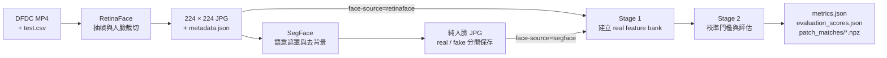
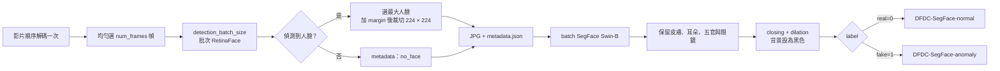
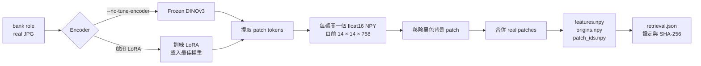

# DeepFakeSecurity

本專案將 DFDC 影片轉成人臉資料，建立 DINOv3 real patch feature bank，再以獨立的 real calibration 與 real/fake evaluation 資料進行異常偵測。所有入口都會自動啟用 Conda 環境 `pt230`。

## 1. 快速開始

```bash
cd /ssd8/chihyu/Project/DeepFakeSecurity

# Step 1：RetinaFace 裁切人臉
bash mission.sh crop-face \
  --num-frames 32 \
  --gpus 0,1,2,3,4

# Step 2：SegFace 保留純人臉並移除背景
bash mission.sh segment-face \
  --cores 5 \
  --gpus 0,1,2,3,4 \
  --batch-size 8

# Step 3：frozen DINOv3 提取 real patch features 並建立 1-NN bank
bash mission.sh stage1 \
  --exper SEGFACE_FROZEN_NN_V1 \
  --face-source segface \
  --no-tune-encoder \
  --method nearest \
  --gpus 0 1 2 3 4 \
  --batch-size 8 \
  --workers 16

# Step 4：以 real calibration 設定門檻，再評估保留的 real/fake
bash mission.sh stage2 \
  --exper SEGFACE_FROZEN_NN_V1 \
  --face-source segface \
  --no-tune-encoder \
  --method nearest \
  --gpus 0 1 2 3 4 \
  --batch-size 8 \
  --workers 16
```

GPU 參數格式依入口不同：

| 任務 | GPU 格式 | 範例 |
| --- | --- | --- |
| `crop-face`、`segment-face` | 逗號分隔 | `--gpus 0,1,2,3,4` |
| `stage1`、`stage2`、`ablation` | 空白分隔 | `--gpus 0 1 2 3 4` |

只建立並檢查資料切分、不提取特徵：

```bash
bash mission.sh stage1 \
  --stage prepare \
  --exper SEGFACE_FROZEN_NN_V1 \
  --face-source segface \
  --no-tune-encoder \
  --method nearest
```

## 2. 完整流程



`--face-source retinaface|segface` 只改變 DINOv3 讀取的 JPG。兩種來源都使用 RetinaFace 的 `metadata.json` 與 DFDC 原始 metadata 維持相同的影片標籤和來源 family 關係。

## 3. 人臉前處理



### 輸入與輸出

| 資料 | 位置／格式 |
| --- | --- |
| DFDC 影片 | `crop_face.data_root` |
| DFDC 清單 | `crop_face.label_csv` |
| RetinaFace | `/ssd8/chihyu/Dataset/DeepFake_Dataset/DFDC/<part>/<video>/` |
| RetinaFace 檔案 | `frame_*.jpg`、`metadata.json` |
| SegFace real | `/ssd8/chihyu/Dataset/DeepFake_Dataset/DFDC-SegFace-normal/` |
| SegFace fake | `/ssd8/chihyu/Dataset/DeepFake_Dataset/DFDC-SegFace-anomaly/` |

SegFace 採用可追溯的扁平檔名：

```text
dfdc_train_part_0-video_name-frame_000001.jpg
```

### 續跑與測試

- RetinaFace 以整支影片的 `metadata.json` 與設定判斷是否完成。
- SegFace 逐張檢查目標 JPG；已完成圖片自動跳過。
- 一般續跑不要加入 `--overwrite`；該參數會強制重做。
- RetinaFace 顯示一條總 `tqdm`；SegFace 每張 GPU 顯示一條 `tqdm`。

```bash
# 小型 RetinaFace 測試：兩支影片、每支四幀
bash mission.sh crop-face --limit 2 --num-frames 4 --gpus 0

# 小型 SegFace 測試：每類一支影片、每支一張
bash mission.sh segment-face --limit 1 --frames-per-video 1 --cores 1 --gpus 0

# RetinaFace CPU 模式
bash mission.sh crop-face --num-frames 32 \
  --gpus none --device cpu --workers 8 --cpu-threads 2
```

## 4. Feature bank

### 固定資料切分

切分單位是 DFDC 原片與其 fake 衍生影片所形成的來源 family。同一 family 不會跨越 Stage 1、calibration 與 evaluation。

目前 `SEGFACE_FROZEN_NN_V1` 的完整切分：

| Role | 影片 | 圖片 | 標籤 | 使用階段 |
| --- | ---: | ---: | --- | --- |
| `bank` | 1,304 | 41,570 | real | Stage 1 |
| `train_fake` | 7,189 | 229,217 | fake | 目前 baseline 不使用 |
| `calibration` | 279 | 8,897 | real | Stage 2 門檻 |
| `evaluation` | 3,141 | 100,107 | real + fake | Stage 2 評估 |

### Stage 1：建立正常參考庫

Stage 1 將 `bank` 中的 real 人臉轉成可搜尋的正常 patch 參考庫。它不設定異常門檻，也不計算測試指標。



Stage 1 依序完成：

1. 建立或沿用 `splits.json`。
2. 依設定使用 frozen DINOv3，或先訓練最後一層 LoRA。
3. 只提取 `bank` real 圖片；目前每張 224×224 圖片得到 `14×14×768` patch features。
4. 將每張圖片保存為 `<part>/<video>/frame_*.npy`，中斷後可逐檔續接。
5. 依 `foreground_minimum` 移除黑色背景比例過高的 patch。
6. 合併 real patches，保存來源圖片和空間位置，再寫入完成紀錄與檔案雜湊。

如果 `method=cross_attention`，Stage 1 會在 real bank 建立後額外訓練受限 Q/K attention。`nearest` 與 `topk` 不需要這一步。

### Stage 2：校準與評估

Stage 2 載入 Stage 1 的同一 encoder 與 real bank，接著：

1. 提取 `calibration` 與 `evaluation` 圖片的 patch features。
2. 讓每個前景 patch 查詢 real bank，取得異常距離與參考來源。
3. 將最高 `top_fraction` 距離取平均；預設使用最高 10% patch。
4. 只用 calibration real 分數的第 `threshold_quantile` 分位設定門檻；預設 99%。
5. 對 evaluation real/fake 計算 AUROC、AP、FPR、TPR，並保存完整 patch 匹配證據。

| `retrieval.method` | Patch 異常距離 |
| --- | --- |
| `nearest` | `1 -` 最相似 real patch 的 cosine similarity |
| `topk` | Top-K real patches 經 cosine softmax 加權後的重建誤差 |
| `cross_attention` | 受限多頭 Q/K attention 對 Top-K real values 的重建誤差 |

圖片分數代表偏離 real bank 的程度，不是 fake 機率。

### Feature bank 輸出

```text
RAG/normal/<EXPERIMENT>/
  bank_config.json
  splits.json
  <part>/<video>/frame_*.npy
  retrieval/
    features.npy
    origins.npy
    patch_ids.npy
  cache/
    calibration/
    evaluation/

outputs/feature_bank/<EXPERIMENT>/
  stage1/
    config.json
    splits.json
    sources.json
    retrieval.json
    dino_lora.safetensors        # 只有啟用 LoRA 時存在
    attention.json               # 只有 cross_attention 時存在
  stage2/
    thresholds.json
    metrics.json
    evaluation_scores.json
    */patch_matches/*.npz
```

## 5. 設定與資源

命令列參數優先於 `utils/config.yaml`。

| YAML 區塊 | 控制內容 |
| --- | --- |
| `crop_face` | DFDC 路徑、抽幀、RetinaFace GPU／batch、門檻、margin、輸出大小 |
| `segment_face` | SegFace 模型、輸入輸出、batch、遮罩與形態學參數 |
| `mission` | SegFace 預設 CPU 核心與 GPU 清單 |
| `retrieval` | 人臉來源、實驗名稱、DINO GPU／batch、LoRA、檢索、門檻與消融 |
| `model_path` | 本地 DINOv3 模型目錄 |

| 常用參數 | 用途 |
| --- | --- |
| `crop-face --detection-batch-size N` | 每次 RetinaFace 推論的幀數 |
| `segment-face --batch-size N` | 每個 SegFace worker 的圖片 batch |
| `segment-face --cores N` | SegFace 使用的 CPU 核心總數；至少等於 GPU 數量 |
| `stage1/2 --batch-size N` | 每張 GPU 的 DINO 圖片 batch |
| `stage1/2 --workers N` | 所有 GPU 共用的 JPG／NPY 讀取執行緒上限 |

### 模型與依賴

```bash
conda run -n pt230 python -m pip install \
  -r requirements-crop.txt \
  -r requirements-segment.txt

# SegFace 權重缺少時執行
conda run --no-capture-output -n pt230 \
  python -m script.setup_segface
```

| 模型 | 路徑 |
| --- | --- |
| RetinaFace | 首次執行下載至 `crop_face.cache_dir/.deepface/weights/` |
| SegFace Swin-B | `models/segface/swinb_celeba_512/model.safetensors` |
| DINOv3 | `model_path`，預設 `models/dinov3-vitb16-pretrain-lvd1689m` |

## 6. 實驗規則

1. Stage 1 與 Stage 2 必須使用完全相同的 `--exper`、`--face-source`、encoder 與 `--method`。
2. 修改資料、模型、LoRA 或評分設定時，建立新的實驗名稱。
3. Stage 2 只接受已完成且雜湊驗證成功的 Stage 1。
4. 相同實驗可直接續跑；輸出鎖會阻止同一實驗重複啟動。
5. `ablation` 需在 Top-K Stage 2 完成後執行，且不覆寫主要結果。
6. 目前結果是 DFDC 清單內的來源 family 切分，不是官方 DFDC test，也不是 identity-disjoint 評估。

建議依序比較：

1. SegFace + frozen DINOv3 + nearest。
2. RetinaFace + frozen DINOv3 + nearest。
3. SegFace + frozen DINOv3 + topk。
4. SegFace + LoRA + topk。

每個實驗只改一個因素，才能判斷改善來自前處理、encoder 或評分方式。

```bash
bash mission.sh --help
bash run.sh --help
```
