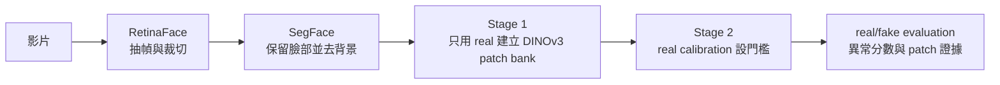

# Real-Only DINOv3 PatchBank for Deepfake Detection

本專案以真實人臉建立正常 patch 特徵庫，再以偏離正常分布的程度偵測 Deepfake。Stage 1 與 Stage 2 的資料、快取及結果各自存放，避免查詢資料混入正常特徵庫。

## 實驗流程



### 程式碼資料夾

```text
Real-Only-DINOv3-PatchBank-for-Deepfake-Detection/
├── Stage1/                         # 只用 real 學習正常表徵並建立 bank
│   ├── fsfm.py                     # CRFR-P 與 feature decoder
│   ├── encoder_tuning.py           # DINOv3 partial fine-tuning 與 EMA teacher
│   ├── bank_builder.py             # real patch index 建立與驗證
│   ├── run.sh                       # Stage 1 專用入口
│   └── README.md
├── Stage2/                         # held-out query 異常檢索與評估
│   ├── bank_search.py              # exact cosine patch search
│   ├── evaluation.py               # 校準、評估、matching 與消融
│   ├── run.sh                       # Stage 2 專用入口
│   └── README.md
├── script/                         # 兩階段共用 I/O、資料切分與人臉前處理
├── tests/
├── run.sh                          # Stage 1／Stage 2 統一入口
└── utils/config.yaml
```

既有的 `bash run.sh stage1|stage2` 介面保持不變，也可分別執行 `bash Stage1/run.sh` 或 `bash Stage2/run.sh`。詳細責任邊界請見 [Stage1/README.md](Stage1/README.md) 與 [Stage2/README.md](Stage2/README.md)。

### Stage 1：建立正常特徵庫

Stage 1 只將 `bank` role 的 real 人臉加入正常庫：

1. 依來源 family 建立固定切分，避免同一原始影片的衍生樣本跨集合。
2. 使用 DINOv3 ViT-B/16 提取 patch token。
3. 若 `encoder_tuning.enabled=true`，以 SegFace 臉部區域執行 CRFR-P token masking，微調最後 2～4 個 DINOv3 blocks、EMA teacher 與輕量特徵 decoder。
4. 移除黑色背景占比過高的 patch。
5. 建立 cosine 檢索索引，保存來源圖片、來源 family 與 patch 位置。

### Stage 2：校準與異常評估

Stage 2 不修改 normal bank：

1. 將 held-out calibration 與 evaluation 圖片另存成 query feature cache。
2. 每個 query patch 到 Stage 1 real bank 查詢相似 patch。
3. `nearest` 使用最近 real patch 的 cosine distance；`topk` 使用 Top-K real patch 的加權重建誤差。
4. 取單張影像中最高 `top_fraction` 的 patch 異常距離平均為 image score。
5. 只用 calibration real 的 `threshold_quantile` 分位數設定門檻，再於 evaluation real/fake 計算 AUROC、AP、FPR 與 TPR。

## 資料夾分工

RAG 位於資料集磁碟，Stage 1 與 Stage 2 完全分開：

```text
/ssd8/chihyu/Dataset/DeepFake_Dataset/RAG/
├── README.md
├── DFDC/
│   ├── Stage1_Real_Feature_Bank/
│   │   └── <EXPERIMENT>/
│   │       ├── bank_config.json
│   │       ├── splits.json
│   │       ├── <part>/<video>/frame_*.npy
│   │       ├── face_regions/<part>/<video>/frame_*.npy
│   │       ├── retrieval/
│   │       │   ├── features.npy
│   │       │   ├── origins.npy
│   │       │   └── patch_ids.npy
│   └── Stage2_Query_Feature_Cache/
│       └── <EXPERIMENT>/
│           ├── calibration/<part>/<video>/frame_*.npy
│           └── evaluation/<part>/<video>/frame_*.npy
└── Celeb-DF/
    ├── Stage1_Real_Feature_Bank/
    └── Stage2_Query_Feature_Cache/
```

專案內的結果也依階段分開：

```text
outputs/DFDC/<EXPERIMENT>/
├── Stage1_Bank_Build/
│   ├── config.json
│   ├── splits.json
│   ├── sources.json
│   ├── retrieval.json
│   ├── encoder_tuning.json
│   ├── encoder_tuning_history.json
│   ├── dino_partial.safetensors
│   └── fsfm_decoder.safetensors       # FSFM 訓練目標使用，推論時不載入
└── Stage2_Anomaly_Evaluation/
    ├── calibration_scores.json
    ├── evaluation_scores.json
    ├── thresholds.json
    ├── metrics.json
    ├── comparison.json                # 非 nearest 方法
    ├── calibration/patch_matches/*.npz
    ├── evaluation/patch_matches/*.npz
    └── ablations/                     # 執行 ablation 才會產生
```

`RAG/README.md` 詳細記錄特徵的來源、前處理、DINO 提取方式及各檔案用途。

## 從頭開始

所有 Python 指令使用 Conda 環境 `pt230`。先檢查 [utils/config.yaml](utils/config.yaml) 的資料來源、GPU 與 `retrieval.experiment`；也可用 `--exper` 在命令列指定實驗名稱。

```bash
cd /ssd8/chihyu/Project/Real-Only-DINOv3-PatchBank-for-Deepfake-Detection

# 1. RetinaFace：從影片抽幀並裁切人臉
bash mission.sh crop-face \
  --num-frames 32 \
  --gpus 0,1,2,3

# 2. SegFace：保留臉部、移除背景
bash mission.sh segment-face \
  --cores 8 \
  --gpus 0,1,2,3 \
  --batch-size 4

# 3. Stage 1：只用 real 建立 normal patch bank
bash run.sh stage1 \
  --exper DFDC_REAL_ONLY_FSFM_PARTIAL4_TOPK_V1 \
  --face-source segface \
  --tune-encoder \
  --unfreeze-blocks 4 \
  --method topk \
  --gpus 0 1 2 3 \
  --batch-size 8 \
  --workers 16

# 選用：Stage 1 完成後先看配對 real/fake 的特徵分布，不更新模型或 bank
bash run.sh cluster \
  --exper DFDC_REAL_ONLY_FSFM_PARTIAL4_TOPK_V1 \
  --gpus 0 \
  --cluster-samples 500 \
  --cluster-count 8

# 4. Stage 2：real calibration + real/fake evaluation
bash run.sh stage2 \
  --exper DFDC_REAL_ONLY_FSFM_PARTIAL4_TOPK_V1 \
  --face-source segface \
  --tune-encoder \
  --unfreeze-blocks 4 \
  --method topk \
  --gpus 0 1 2 3 \
  --batch-size 8 \
  --workers 16
```

Stage 1 與 Stage 2 必須使用相同的實驗名稱、face source、encoder 與檢索方法。若設定改變，請建立新的實驗名稱；程式會用設定與 SHA-256 阻止不相容的資料續跑。

若只想先產生並檢查資料切分：

```bash
bash run.sh stage1 --stage prepare --exper DFDC_REAL_ONLY_TOPK_V1
```

一次完成兩階段：

```bash
bash run.sh all --exper DFDC_REAL_ONLY_TOPK_V1
```

GPU 參數格式不同：前處理使用逗號分隔，例如 `--gpus 0,1,2,3`；Stage 1／2 使用空白分隔，例如 `--gpus 0 1 2 3`。空的 `--gpus` 表示使用 CPU。

## 主要設定

| YAML 欄位 | 用途 |
| --- | --- |
| `retrieval.bank_dir` | Stage 1 real feature bank 根目錄 |
| `retrieval.stage2_cache_dir` | Stage 2 calibration/evaluation query cache 根目錄 |
| `retrieval.results_dir` | 階段報告與評估結果根目錄 |
| `retrieval.face_source` | `segface` 或 `retinaface` |
| `retrieval.encoder_tuning.enabled` | 是否執行 real-only DINOv3 encoder tuning |
| `retrieval.encoder_tuning.unfreeze_blocks` | Partial fine-tuning 解凍的最後 blocks 數量，預設 4 |
| `retrieval.encoder_tuning.fsfm` | CRFR-P 比例、token masking、decoder 與重建 loss 權重 |
| `retrieval.topk` | Top-K 候選數與 cosine softmax temperature |
| `retrieval.method` | `nearest` 或 `topk` |
| `retrieval.foreground_minimum` | patch 的最小非黑色占比 |
| `retrieval.top_fraction` | 聚合成 image score 的最高異常 patch 比例 |
| `retrieval.threshold_quantile` | calibration real 的門檻分位數 |

查看完整參數：

```bash
bash mission.sh --help
bash run.sh --help
```

## 模型位置

| 模型 | 設定位置 |
| --- | --- |
| RetinaFace | `crop_face.cache_dir/.deepface/weights/` |
| SegFace Swin-B | `segment_face.model_dir` + `segment_face.checkpoint` |
| DINOv3 | `model_path` |

若 SegFace 權重尚未安裝：

```bash
conda run --no-capture-output -n pt230 python -m script.setup_segface
```

開始前可檢查兩個推論權重：

```bash
test -f models/dinov3-vitb16-pretrain-lvd1689m/model.safetensors
test -f models/segface/swinb_celeba_512/model.safetensors
```

DINOv3 是 gated model，需先在 Hugging Face 接受授權，再將 `model.safetensors` 放入 `model_path`。Frozen baseline 可直接沿用既有 SegFace JPG；FSFM-inspired 實驗還會使用 SegFace checkpoint 建立臉部區域快取，但不必重新輸出去背景 JPG。

## FSFM-inspired Stage 1

此實作參考 [FSFM（CVPR 2025）](https://openaccess.thecvf.com/content/CVPR2025/html/Wang_FSFM_A_Generalizable_Face_Security_Foundation_Model_via_Self-Supervised_Facial_CVPR_2025_paper.html)，並針對既有 DINOv3 PatchBank 做以下調整：

1. 使用原始 RetinaFace crop 重新取得 SegFace 19 類語意圖，再依既有 SegFace bounding box 對齊。
2. 語意圖縮成 14×14 並存入 Stage 1 的 `face_regions/`；只處理實際會進入 train/validation schedule 的 real 圖片。
3. CRFR-P 完整遮住一個眉毛、眼睛、鼻子、嘴巴、頭髮或臉部邊界區域，再於其他前景區域等比例遮罩，總比例預設 75%。
4. 使用 DINOv3 原生 `bool_masked_pos` 將選中位置換成模型的 mask token，不再將影像 patch 塗黑。
5. 凍結前 8 個 blocks，微調最後 4 個 blocks 與 final norm；可用 `unfreeze_blocks` 改成 2。
6. EMA teacher 讀取完整臉部，提供 clean patch target；兩層 Transformer decoder 從 masked student features 重建 target。
7. 損失包含 masked feature reconstruction、完整臉部區域 reconstruction、local-to-global consistency 與 EMA consistency。
8. Decoder 與 EMA teacher 只負責 Stage 1 訓練；建立 Feature Bank 與 Stage 2 推論時只載入最佳 student partial checkpoint。

官方 FSFM 同時包含 MAE pixel reconstruction、representation decoder 與 EMA target branch；這裡保留臉部區域 masking 和 EMA feature target，但以 DINOv3 feature reconstruction 配合 real-only PatchBank，因此實驗名稱與報告均標示為 `FSFM-inspired`。
